# LeadLens ⚡

**Enterprise Agentic B2B Sales Outreach Platform with Tiered Model Routing and Human-in-the-Loop (HITL) Controls.**

LeadLens automates technical company discovery, infrastructure profiling, value-proposition synthesis, and hyper-personalized cold outreach email drafting for modern enterprise sales teams.

---

## Architecture Overview

```mermaid
flowchart LR
    A[Target Company / CSV] --> B[Agent 1: Gatekeeper<br/><i>Gemini Flash + Search</i>]
    B --> C[Agent 2: Intel Analyst<br/><i>Architecture Profiler</i>]
    C --> D[Agent 3: Solutions Architect<br/><i>ICP Fit & Value Mapping</i>]
    D --> E[Agent 4: Sales Director<br/><i>A/B Copywriting & Reflection</i>]
    E --> F[Agent 5: Compliance Guard<br/><i>Deliverability & Spam Audit</i>]
    F --> G[HITL Command Center<br/><i>Diff Editor & Email Client Mock</i>]
    G --> H[Outbound Delivery<br/><i>Verified SMTP Dispatch</i>]
```



---

## 5-Agent Autonomous DAG Pipeline

1. **Agent 1 — Gatekeeper** *(Gemini Flash + Google Search Grounding)*:
   - Identifies the key decision maker (CTO, VP of Engineering, Head of Infrastructure).
   - Extracts corporate email patterns, verified LinkedIn URL, location footprint, and employee count.

2. **Agent 2 — Intel Analyst** *(Gemini Flash + Technical Profiling)*:
   - Analyzes public engineering blogs, DNS records, and job listings to identify infrastructure footprint (AWS/GCP/Azure, Kubernetes, Docker, Go/Node, databases, Datadog observability).

3. **Agent 3 — Solutions Architect** *(Gemini Pro Reasoning Tier)*:
   - Evaluates prospect tech stack against campaign ICP parameters.
   - Calculates **ICP Fit Score (0–100%)**.
   - Pinpoints acute technical bottlenecks (e.g. idle compute allocation, container over-provisioning) and maps concrete solution ROI.

4. **Agent 4 — Sales Director** *(Gemini Pro Reasoning Tier)*:
   - Generates two high-converting subject line variants:
     - **Variant A**: Direct Technical Angle
     - **Variant B**: Executive ROI Angle
   - Writes a concise, under-140-word outreach email referencing exact infrastructure.
   - Generates an automated **Step 2 Follow-Up Email** (Day 3 soft check-in).
   - Performs self-reflection critique with a 1–10 quality rubric.

5. **Agent 5 — Compliance & Deliverability Guard** *(Enterprise Safety Layer)*:
   - Scans copy against high-risk spam keywords.
   - Calculates **Deliverability Score (0–100)** and **Spam Risk rating** (`Low`, `Medium`, `High`).
   - Validates CAN-SPAM and GDPR opt-out requirements and estimates recipient reading time.

---

## Key Features

- **Linear / Cursor Style AI Startup UI**: Sleek dark space theme, glassmorphic headers, responsive layout, and glowing telemetry indicators.
- **Interactive Agent Studio**: Visual DAG node graph displaying model tiers, token metrics, execution latencies, system prompts, and JSON output schemas.
- **Lead Command Center**:
  - **Email Studio**: Live editor, A/B subject switcher, and Day 1 / Day 3 sequence tabs.
  - **AI vs Human Diff Viewer**: Compare original AI drafts against human edits side-by-side.
  - **Gmail Client Simulator**: Preview how outreach appears inside a recipient's inbox.
  - **1-Click SMTP Outbound**: Send directly via configured SMTP transport.
- **Command Palette (`Ctrl+K` / `⌘K`)**: Fast spotlight navigation across accounts, views, and actions.
- **Batch Prospect Importer**: Ingest accounts in bulk via `.csv` file upload or multi-line domain input.
- **Executive ROI & Token Economics**: Tracks token volume, cost savings percentage (~70%+ saved vs naive single-model routing), and hours of manual research reclaimed.
- **Campaign & ICP Studio**: Define and switch between multiple B2B sales campaigns with distinct value propositions and tones.

---

## Tech Stack

- **Frontend**: React 18, Vite 5, Lucide Icons, Vanilla CSS Design System
- **Backend**: Node.js, Express REST API, Server-Sent Events (SSE)
- **Database**: SQLite3 with automatic schema migration and resilient recovery guard
- **AI Models**: Google Gemini API (`gemini-2.5-flash` with Google Search Tool + `gemini-2.5-pro`), Cerebras Cloud fallback
- **Email Delivery**: Nodemailer SMTP transport

---

## Quick Start

### 1. Clone & Install Dependencies

```bash
git clone https://github.com/Deep-Chauhan-04/leadlens.git
cd leadlens
npm install
```

### 2. Configure Environment

Copy `.env.example` to `.env` and provide your credentials:

```bash
cp .env.example .env
```

```env
GEMINI_API_KEY=your_gemini_api_key_here
PORT=5000

# SMTP Configuration (For outbound delivery)
SMTP_HOST=smtp.gmail.com
SMTP_PORT=587
SMTP_USER=your_email@gmail.com
SMTP_PASS=your_app_password
SMTP_FROM_NAME=Your Company Name
SMTP_FROM_EMAIL=your_email@gmail.com
```

### 3. Launch Development Server

```bash
npm run dev
```

* **Frontend**: [http://localhost:3000](http://localhost:3000)
* **Backend API**: [http://localhost:5000](http://localhost:5000)

---

## License

MIT License. Designed for modern B2B sales development and growth engineering teams.
